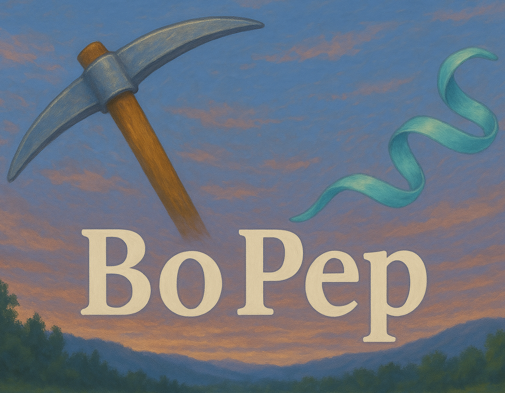
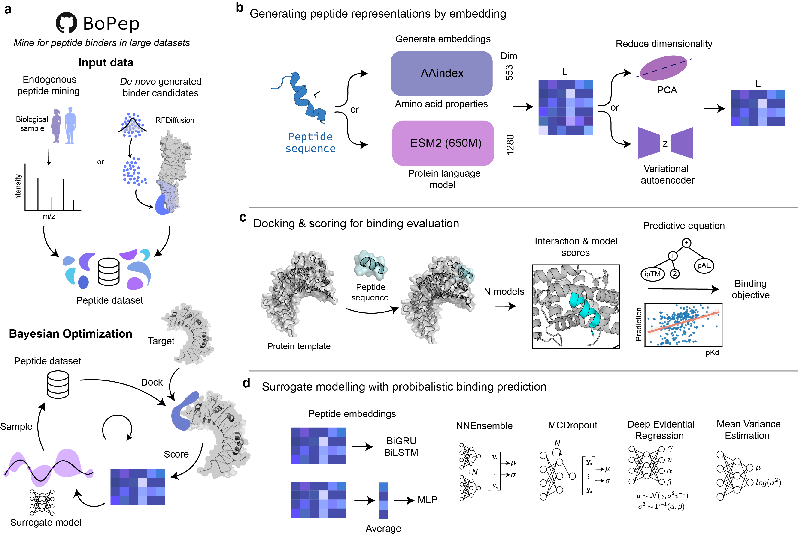
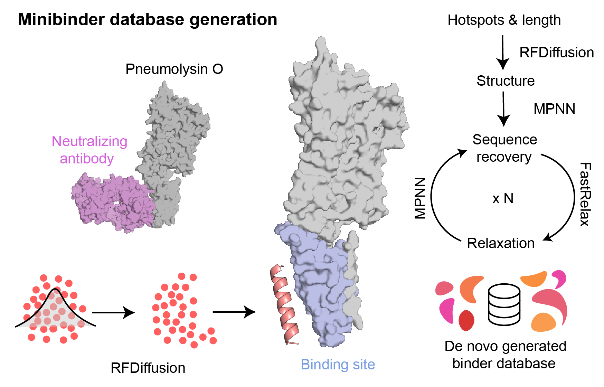

<p align="center">
  
</p>

## *BoPep: Navigating the binder landscape*

This repository contains the code for `BoPep`, a method suite for identifying and generating proteins and peptides using Bayesian Optimization (BO). We have currently implemented three different methods in the BoPep framework:

- **BoPep search**: This is the core method for BoPep, which uses Bayesian Optimization to navigate through large datasets in search for proteins that optimize some objective.
- **BoRF**: A design module for generating a large dataset using a diffusion pipeline, which is then searched with BoPep.
- **BoGA**: A module which allows you to generate proteins using a surrogate model guided evolutionary algorithm.

> NOTE: We are currently working on updating the documentation for BoPep with instructive examples and API references.

### TODO
Add examples on how to run:
- [ ] Embeddings
- [ ] Search
- [ ] BoGA
- [ ] BoRF

Add documentation including "how-to" for:
- [ ] Search
- [ ] BoGA
- [ ] BoRF


## Installation

To run `bopep` locally, you will need to clone this repository, as well as dependencies which vary based on what you want to optimize for. If you wish to use AlphaFold and/or Boltz, you will need to install **LocalColabFold** and/or **Boltz**. **PyRosetta** is always needed as well as other dependencies included in `requirements.txt`. Follow the steps below to set up your environment:

### Step 1: Clone the Repository

First, clone the repository to your local machine (not available on pip yet):

```bash
git clone https://github.com/ErikHartman/bopep.git
cd bopep
```

### Step 2: Set Up a Virtual Environment

It’s recommended to set up a virtual environment to keep dependencies isolated:

```bash
python -m venv bopep_env # Or python3
source bopep_env/bin/activate
```

### Step 3: Install Dependencies

1. (a) If you would like to dock/fold with AlphaFold: **Install LocalColabFold**: LocalColabFold is a fantastic package that allows you to run ColabFold locally. Follow the installation procedure [here](https://github.com/YoshitakaMo/localcolabfold) to install it.

Remember to export the `PATH` variable and make sure `colabfold_batch` is callable by running:

```bash
# For bash or zsh
# e.g. export PATH="/home/moriwaki/Desktop/localcolabfold/colabfold-conda/bin:$PATH"
export PATH="/path/to/your/localcolabfold/colabfold-conda/bin:$PATH"

colabfold_batch --help
```

This should work if you follow the instructions in the LocalColabFold git repo.

1. (b) If you would like to dock with Boltz: **Install Boltz**: Boltz-2 is another nice way of docking through co-folding. Follow the installation procedure [here](https://github.com/jwohlwend/boltz) to install Boltz-2. Make sure you can run boltz after installing.


2. **Install PyRosetta**: PyRosetta is freely available for academic users and is used to score complexes. Any commercial usage requires the purchasing of a license.

   - Go to the [PyRosetta download page](https://www.pyrosetta.org/downloads) and read up on the terms for the license.
   - Install PyRosetta in your environment using the [pyrosetta-installer](https://pypi.org/project/pyrosetta-installer/) with pip:

    ```bash
   pip install pyrosetta-installer
   ```

   - Then run:

   ```bash
   python -c 'import pyrosetta_installer; pyrosetta_installer.install_pyrosetta(skip_if_installed=True)'
   ```
3. **OPTIONAL: Install RFdiffusion and ProteinMPNN**: 
    If you wish to run BoRF you need to install RFdiffusion and ProteinMPNN. To install these packages, follow the instructions in their respective repositories: [ProteinMPNN](https://github.com/dauparas/ProteinMPNN) and [RFdiffusion](https://github.com/RosettaCommons/RFdiffusion).

4. **Install Remaining Dependencies**:
   Finally, install any additional dependencies required for `bopep`:

   ```bash
   pip install -r requirements.txt
   ```

## Modules

### Surrogate modelling
The task of the surrogate model is to learn a mapping between the embedding and the score. We use probibalistic deep learning models to do so. The architectures include: BiGRU, BiLSTM and MLP. 

The probibalistic modalities include: an ensemble of networks, MC dropout, deep evidential regression and mean-variance estimation.

### Docking
Docking is performed to predict the complex structure given a target and a sequence. We support docking via co-folding using AlphaFold and/or Boltz.

### Scoring
Scoring of complexes defines the fitness/reward which is maximized during search. It should correlate with binding probability/affinity. We have defined a score called `benchmark_objective_v1` using data from PDBBind. You can also provide your own objective function easily.

### Embedding
Embedding serves to create a navigatable space of seqeunce representations. We support embedding through AAindex and ESM-2. You can also create your own embeddings and pass to the BO search function.


## Search datasets (BoPep)
The core of the BoPep framework lies in searching large datasets for binders. It does so by training a surrogate model to predict whether a seqeuence will bind or not to a given target, based on embeddings and previous docking experiments. During the search, the sequence dataset is navigated with the help of surrogate models. 

<p align="center">
  
</p>

## Generation with diffusion (BoRF)
We also provide a way to generate large candidate datasets using an RFdiffusion + ProteinMPNN + FastRelax pipeline. By sampling lengths and hotspots we generate a large diverse dataset of candidate sequences. We can then apply the BoPep search on the datasets, leading to less computationally expensive design of binders.
<p align="center">
  
</p>

## Generation with evolutionary algorithm (BoGA)
The surrogate models can also be leveraged from design. The BoGA algorithm uses the surrogate models in an evolutionary algorithm to generate a binder from a biological prior. The prior can be either a single sequence or a set of sequences.

*_preprint coming soon_

## Versions

### 27 Nov 2025 $\rightarrow$ current
I consider this **version 1** due to major changes in the workflow. Here, the package expanded to sequence optimization OVERALL. This included unconditional and sequence generation. As such, many APIs and variables were changed from "peptide" to "sequence". Some examples in `/examples` may still be outdated and be called "peptide" or "pep".


### Beginning $\rightarrow$ 27 Nov 2025
I consider this **version 0**. The main experiments were run to showcase BoPep and BoGA. This version focused on *peptide* binder searching and design (hence the name BoPep).


## Cite

If you use this paper, please cite:

If you use BoGA, please cite:

Additionally, please cite the relevant papers below for your use case: 

```bib
@article{Mirdita2022,
  title = {ColabFold: making protein folding accessible to all},
  volume = {19},
  ISSN = {1548-7105},
  url = {http://dx.doi.org/10.1038/s41592-022-01488-1},
  DOI = {10.1038/s41592-022-01488-1},
  number = {6},
  journal = {Nature Methods},
  publisher = {Springer Science and Business Media LLC},
  author = {Mirdita,  Milot and Sch\"{u}tze,  Konstantin and Moriwaki,  Yoshitaka and Heo,  Lim and Ovchinnikov,  Sergey and Steinegger,  Martin},
  year = {2022},
  month = may,
  pages = {679–682}
}
```
```bib
@article{Evans2021,
  title = {Protein complex prediction with AlphaFold-Multimer},
  url = {http://dx.doi.org/10.1101/2021.10.04.463034},
  DOI = {10.1101/2021.10.04.463034},
  publisher = {Cold Spring Harbor Laboratory},
  author = {Evans,  Richard and O’Neill,  Michael and Pritzel,  Alexander and Antropova,  Natasha and Senior,  Andrew and Green,  Tim and Žídek,  Augustin and Bates,  Russ and Blackwell,  Sam and Yim,  Jason and Ronneberger,  Olaf and Bodenstein,  Sebastian and Zielinski,  Michal and Bridgland,  Alex and Potapenko,  Anna and Cowie,  Andrew and Tunyasuvunakool,  Kathryn and Jain,  Rishub and Clancy,  Ellen and Kohli,  Pushmeet and Jumper,  John and Hassabis,  Demis},
  year = {2021},
  month = oct 
}
```
```bib
@article{Chaudhury2010,
  title = {PyRosetta: a script-based interface for implementing molecular modeling algorithms using Rosetta},
  volume = {26},
  ISSN = {1367-4803},
  url = {http://dx.doi.org/10.1093/bioinformatics/btq007},
  DOI = {10.1093/bioinformatics/btq007},
  number = {5},
  journal = {Bioinformatics},
  publisher = {Oxford University Press (OUP)},
  author = {Chaudhury,  Sidhartha and Lyskov,  Sergey and Gray,  Jeffrey J.},
  year = {2010},
  month = jan,
  pages = {689–691}
}
```
```bib
@misc{akiba2019optunanextgenerationhyperparameteroptimization,
      title={Optuna: A Next-generation Hyperparameter Optimization Framework}, 
      author={Takuya Akiba and Shotaro Sano and Toshihiko Yanase and Takeru Ohta and Masanori Koyama},
      year={2019},
      eprint={1907.10902},
      archivePrefix={arXiv},
      primaryClass={cs.LG},
      url={https://arxiv.org/abs/1907.10902}, 
}
```
```bib
@article{Lin2023,
  title = {Evolutionary-scale prediction of atomic-level protein structure with a language model},
  volume = {379},
  ISSN = {1095-9203},
  url = {http://dx.doi.org/10.1126/science.ade2574},
  DOI = {10.1126/science.ade2574},
  number = {6637},
  journal = {Science},
  publisher = {American Association for the Advancement of Science (AAAS)},
  author = {Lin,  Zeming and Akin,  Halil and Rao,  Roshan and Hie,  Brian and Zhu,  Zhongkai and Lu,  Wenting and Smetanin,  Nikita and Verkuil,  Robert and Kabeli,  Ori and Shmueli,  Yaniv and dos Santos Costa,  Allan and Fazel-Zarandi,  Maryam and Sercu,  Tom and Candido,  Salvatore and Rives,  Alexander},
  year = {2023},
  month = mar,
  pages = {1123–1130}
}
```
```bib
@article{Passaro2025,
  title = {Boltz-2: Towards Accurate and Efficient Binding Affinity Prediction},
  url = {http://dx.doi.org/10.1101/2025.06.14.659707},
  DOI = {10.1101/2025.06.14.659707},
  publisher = {Cold Spring Harbor Laboratory},
  author = {Passaro,  Saro and Corso,  Gabriele and Wohlwend,  Jeremy and Reveiz,  Mateo and Thaler,  Stephan and Somnath,  Vignesh Ram and Getz,  Noah and Portnoi,  Tally and Roy,  Julien and Stark,  Hannes and Kwabi-Addo,  David and Beaini,  Dominique and Jaakkola,  Tommi and Barzilay,  Regina},
  year = {2025},
  month = jun 
}
```
